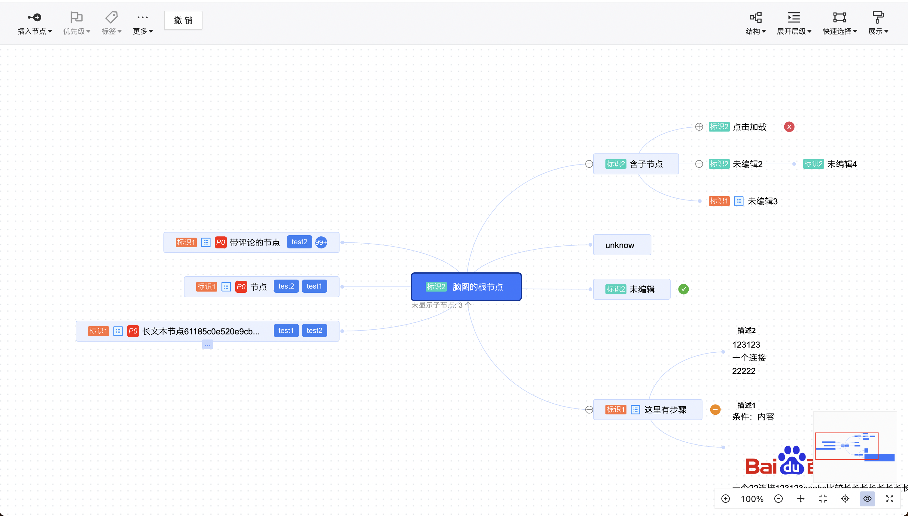

## react-minder-craft 
基于 [ant-design](https://github.com/ant-design/ant-design)，对 [kityminder-editor](https://github.com/fex-team/kityminder-editor) 进行 `React` 重构版本。

用更现代的 UI 组件库改善用户体验。

[English](./README.md) | 简体中文


## 安装

```bash
yarn install
```

## 使用
```jsx
import React from 'react';
import 'react-minder-craft/dist/css/index.css';
import ReactMinderCraft from 'react-minder-craft/es';


export default () => <ReactMinderCraft />
```

## 样例

```bash
yarn start
```

更多样例查看 `example` 目录。也可以查看开发细节 [handbook](./doc/handbook.md)

## 屏幕截图



## F&Q

如果想本地调试，可能需要先安装 `react` `react-dom` 和 `antd`，具体可以查看 `package.json > peerDependencies`